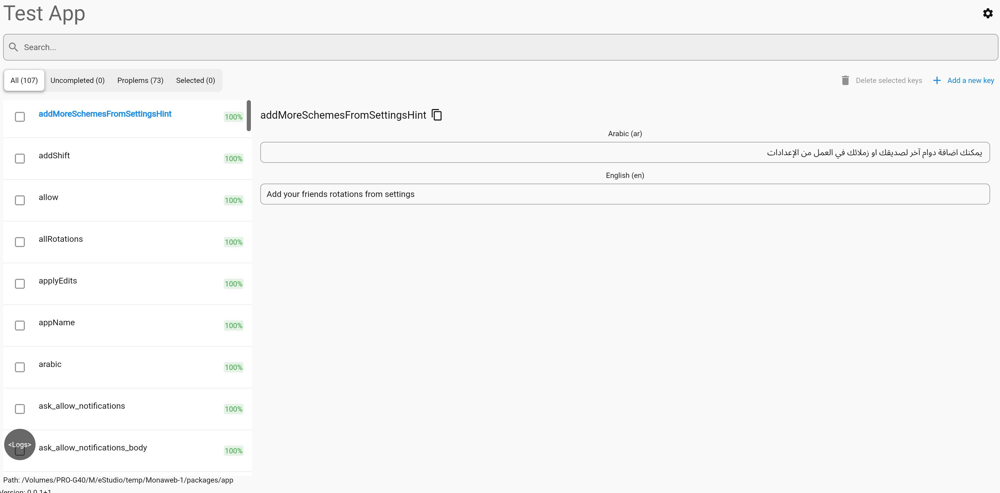
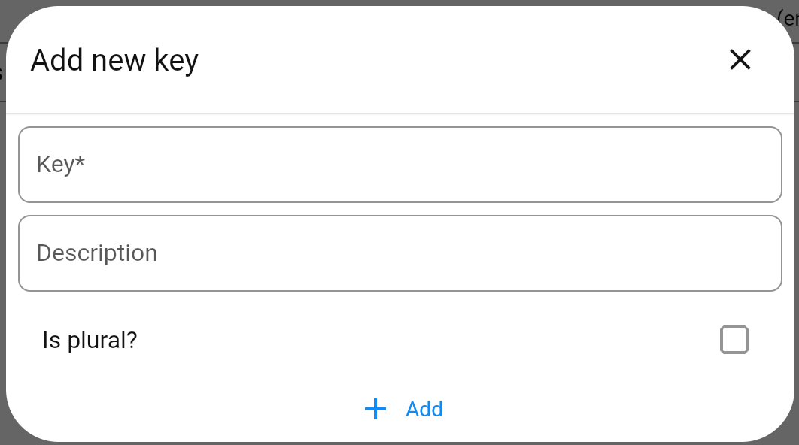
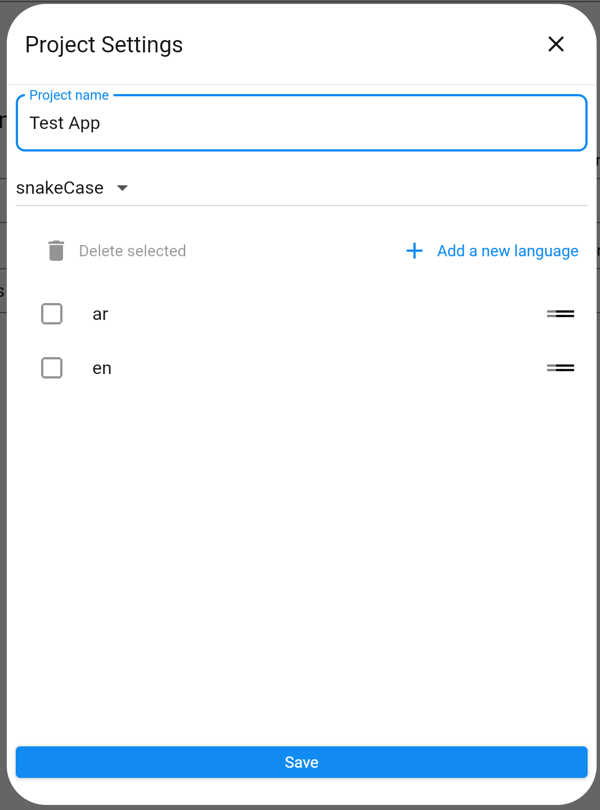

[](https://pub.dev/packages/locmate)

# Locmate 📍

**Locmate** is an all-in-one localization management suite for Dart and Flutter. It bridges the gap between raw translation files and a user-friendly management interface. It is a visual editor for Application Resource Bundle (`.arb`) localization files, designed for projects using the [intl](https://pub.dev/packages/intl) package. The editor runs locally, so you can use Git and never have to upload or download localization files.

## ❤️ Open Source & Community

Locmate is 100% Free and Open Source. It was built by developers, for developers, to make the localization process less painful.





## Contents

* [Overview](#-overview)
* [Locmate CLI](#-locmate-cli)
  * [Features](#features)
  * [Installation](#installation)
  * [Usage](#usage)
* [Locmate Web](#-locmate-web)

## 🚀 Overview

Locmate is split into two core components:

1. **Locmate CLI** – A powerful command-line tool to sync, generate, and manage your `.arb` files.
2. **Locmate Web** – A local-running web dashboard to visualize, edit, and audit your translations in real-time.

---

## 💻 Locmate CLI

The engine under the hood. The CLI handles the heavy lifting of file manipulation and code generation.

### Features

#### Supported

* Add and remove localization keys
* Add and remove languages
* Add, edit, and remove placeholder variables
* Edit the ICU value of a localization entry using a visual editor
  * Text blocks
  * Arguments
  * Select with branches
  * Plural with branches
    * Plural arguments
* Dark theme

#### Planned

* Fix Logs
* Enhance error handling
* A subscription service for automated machine translations (e.g. using DeepL)

### Installation

Activate Locmate globally:

```bash
dart pub global activate locmate
```


### Usage

Navigate to the directory containing the `l10n.yaml` file in your terminal, then run:

```bash
dart pub global run locmate
```

---

## 🌐 Locmate Web

Locmate Web is a Flutter web app (in `packages/locmate_web`) that provides a local dashboard to visualize, edit, and audit your translations in real time. Run it from the project (e.g. via the workspace scripts) to use the visual editor in your browser.

**Warning:** This project is very early in development—use with caution. Ensure important changes are committed before trying it out.
